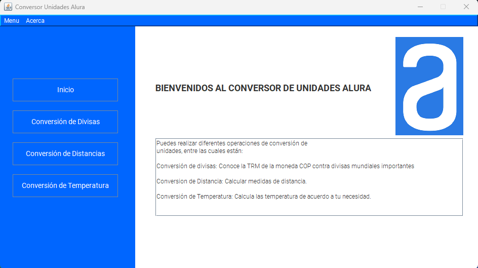

# conversor_alura: Convierte Diferentes Tipos de Unidades

# Conversor de Medidas 
Con este conversor puedes realizar las siguientes operaciones, las cuales a través de una interfaz
gráfica, le proporciona al usuario una manera interactiva, mejorando la experiencia del usaurio al 
momento de usarla.

|Nombre | Funcionalidad | Estado | Descripción                                                                 |
|--------|--------------------------------|-----------|---------------------------------------------------------------------------|
| Divisas | Conversor de divisas      | ✔️         | Tranformación de divisas entre moneda local y extranjera.                      |
| Temperaturas | Conversor de temperatura  | ✔️         | Esta función permite transformar temperatura entre sus 3 unidades principales.                                              |
| Distancias| Conversor de distancias   | ✔️         | Esta función permite transformar distancias entre las 2 unidades más usadas.      

# Condiciones de uso 🤖

-  No se admiten valores negativos.
-  No se admiten operaciones, ni símbolos, ni letras o caracteres especiales, solo números.
-  El formato no admite comas.

# Evolución de la implementación a interfaz gráfica y ejecutable

